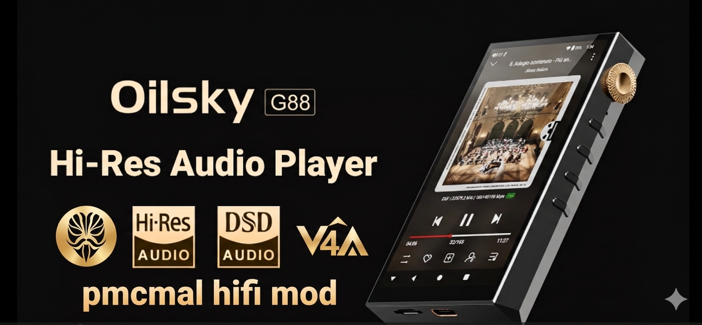

# DAP Oilsky G88 - Magisk Rooting & Audio Guide

> ⚠️ **Unlock Bootloader = WIPE ALL DATA.** ⚠️

> **Backup your important files** before proceeding. **Proceed at your own risk**! If you do something wrong or your device gets damaged, **I'm not responsible**. Although I bricked it three times while creating this repo and managed to rescue it using Flash Tool :)

---
  

## 📋 Table of Contents in this repo

- System Preparation and software for windows

- Bootloader Unlocking (for flashing custom images)

- Magisk Patching Process (for root access and modules)]

- Firmware & Tools (some tips and tools)

- Patching audio_policy.xml file

- Viper4Android Installation (for EQ and audio effects)

-  Bonus & Future plans (maybe you can help?)

  

---

# ⚙️ Magisk Rooting Guide (Stock Firmware)

  

This guide provides a step-by-step walkthrough for rooting your device using Magisk on clean, stock software.

  

>  [!WARNING]

>  **Unlocking the bootloader will wipe all user data.** Ensure you have backed up your important files before proceeding.

  

---

  

## 1. System Preparation

1. Power on the device and complete the initial setup.

2. **Enable Developer Options:**  * Navigate to **Settings > Device Info**.

* Tap the **Model (Oilsky G88)** entry repeatedly (7 times) until a toast message appears: *"You are now a developer!"*

3. **Configure Developer Settings:**

* Go to **Settings > System > Developer Options**.

* Enable **USB Debugging**.

* Enable **OEM Unlocking**.

  

---

  

## 2. 🔓 Bootloader Unlocking

1. Connect your phone to your PC via USB.

2. **Authorize Connection:** Check your phone screen for a prompt. Select **"Allow USB Debugging"** (check *"Always allow from this computer"* for convenience).

3. Open PowerShell or CMD and reboot the device into the bootloader:

`adb reboot bootloader`

4. Once the phone is in Bootloader/Fastboot mode, execute the unlock command:

`fastboot oem unlock`

###### Note: Follow any on-screen prompts on your phone to confirm the unlock. Note: Follow any on-screen prompts on your phone to confirm the unlock.

---

  

## 3. 📱 Initial Boot & preparation of the system

1. After unlocking, reboot the system:

` fastboot reboot`

2. The system will perform a factory reset.

3. Now, every time you turn on the device, there will be an **"Orange state"** which is an alert that the device is unlocked, this cannot be avoided

4. Crucial: You must go through the setup process and enter the OS again to ensure the bootloader status is fully registered by the system before proceeding with the root.

5. Enable **USB Debugging** again.

###### Note: The first start may take some time

  

---

  

## 📦 4. Magisk Patching Process

1. Transfer the stock boot.img file from your clean firmware to the phone's internal storage.

2. Install the Magisk app. / may be on another device

3. In the app, tap Install > Select and Patch a File and select your boot.img.

4. Magisk will generate a file named magisk_xxxx.img (typically saved in the Download folder).

5. Change your name to magisk_patched, it'll be easier later

6. Copy this magisk_patched.img back to your computer.

###### Note: Alternatively, you can use the pre-patched boot file provided in the Google Drive link in this repository. Note: Alternatively, you can use the pre-patched boot file provided in the Google Drive link in this repository. [complete rom and tool](https://drive.google.com/file/d/1xSxhixdCyRRYNq9t36CPd77ul7RXDiwC/view?usp=sharing "complete rom and tool") and in this repo its patched_boot.zip

  

---

  

## 🪄 5. Flashing the Patched Boot Image

1. in the folder where you have boot patched boot at the top of the bar, click and type `cmd` enter (to open command line terminal)

2. Reboot the phone into bootloader mode once more:

`adb reboot bootloader`

3. Flash the patched image to the boot partition:

`fastboot flash boot magisk_patched.img`

5. Finalize the process by rebooting:

` fastboot reboot`

  

---

  

## 💡 4. Finishing installing magisk on your device

1. Turn on wifi and connect to the network on the oilsky device

2. The Magisk app should appear grayed out on your screen, click on it.

3. Magisk will download and install the full latest version apk

4. Open the Magisk app and you'll see install appear. Click install.

5. Magisk will reboot the device, installation will fail

6. Try installing Magisk again after it boots up. This time, you'll be presented with a menu to choose a method. Select "Direct install"

7. A terminal with logs will appear, everything should be ok and it will ask for a reboot at the end

  

---

  

# 📂 Clean firmware stock

[firmware link and flashtool](https://drive.google.com/file/d/1xSxhixdCyRRYNq9t36CPd77ul7RXDiwC/view?usp=sharing "firmware link and flashtool")

  

---

  

# ✏️ Extras: How to extract boot.img using Python (MTK Client)

*If your device has newer software, I suggest taking a boot.img dump from the device or flashing the system from the link using a flash tool. *

1. Requirements

Install Python: pip install mtkclient

Git clone the tool: git clone https://github.com/bkerler/mtkclient or use a copy that works in this repository. Named mtk_client.

Install drivers (Usbdk or LibUSB).

2. Use mtk client commands with the preloader flag extracted from the firmware link. Preloader for this device is in my repo files.

3. Uploading .img files via mtk client causes **Red state** so upload files only via fastboot!

  

---

  

# 🎧 Install Viper4Android

To get the best audio experience, follow these steps

### 📥 Prerequisites
*I add files to the repository if they expire from the internet (often the magisk module or other files disappear). I'm sure these work.*

- [ACP (Audio Compatibility Patch)](https://mmrl.dev/repository/aptoftisk/acp "ACP (Audio Compatibility Patch)")

- [AML (Audio Modification Library)](https://mmrl.dev/repository/aptoftisk/aml "AML (Audio Modification Library)")

- [Magical OverlayFS](https://mmrl.dev/repository/zguectZGR/magisk_overlayfs "Magical OverlayFS")

- [Viper4Android RE Fork (latest zip and apk)](https://github.com/AndroidAudioMods/ViPER4Android/releases "Viper4Android RE Fork (latest zip and apk)")

**Thanks and respect to everyone who wrote and came up with all these solutions. It's a ton of work! :)**

  

### 🚀 Installation Steps

1.Install Magical OverlayFS in Magisk & Reboot. (Allows RW permissions to /vendor).

2.Install ACP in Magisk & Reboot.

3.Install AML in Magisk & Reboot.

4.Install Viper4Android RE in Magisk & Reboot.

5.Install the Viper4Android APK.

  

## 🛠️ Configuration for ESS9018 DAC

**You can find the finished file with modifications in the repo under the name audio_policy_configuration.xml (make sure yours is the same if you have newer software).**

1. 📝 Viper4android Repair Processing: No

`adb shell "cat /vendor/etc/audio_effects.xml | grep -A 5 -B 5 v4a"` will show us that the viper4android libraries are loading correctly, but the problem is **"audio offload."** This is when the system bypasses the entire Android software stack and sends the audio directly to the digital signal processor (DSP).

2. **Enable legacy mode** in viper4android by clicking on the wheel (settings) and enabling legacy mode (first option)

3. In the `/vendor/etc/audio_policy_configuration.xml` file you need to change `<mixPort name="direct_pcm" role="source" flags="AUDIO_OUTPUT_FLAG_DIRECT">` to `<mixPort name="direct_pcm" role="source" flags="">` and delete in all `<routes>`  <route  type="mix"  sink="Earpiece"  sources="primary output,deep_buffer"/> word **direct_pcm** to stop direct and allow viper4android to edit sound before send it to ess9018 dac.

5. Copy audio_policy.. file to windows computer: in cmd: `adb pull /vendor/etc/audio_policy_configuration.xml F:\python\audio_policy.xml` (change your destination)

6. Create overlay catalog in device: `adb shell su -c "mkdir -p /data/adb/modules/overlayfs/system/vendor/etc/"`

7. Send modified file to device: `adb push F:\python\audio_policy.xml /sdcard/audio_policy_configuration.xml`

8. 🛡️ We move files using root: `adb shell su -c "mv /sdcard/audio_policy_configuration.xml /data/adb/modules/overlayfs/system/vendor/etc/audio_policy_configuration.xml"` and give them permissions

`adb shell su -c "chmod 644 /data/adb/modules/overlayfs/system/vendor/etc/audio_policy_configuration.xml"`

9. 🔄 `adb reboot` (Restart and check if viper4android works) it should :)

  

---

  

>  [!Tip]

> ☕ If I helped, give me a tip, I spent several evenings on it :) https://tipped.pl/pmcmalec

  

---

  

# 🛠️ What else can be done?

- 📱 Project Treble: Porting newer pure Android (GSI).

- 🏗️ TWRP Recovery: Developing custom recovery for easier modifications.

- 📉 Noise Reduction: Modifying /vendor files to reduce noise at low volumes.

- ⚡ Optimization: Magisk modules to improve system speed.

- 🎶 HiFi Apps: Installing advanced playback apps (Poweramp, UAPP).

- 🧹 Debloating: Removing unnecessary services (until TWRP is available).
